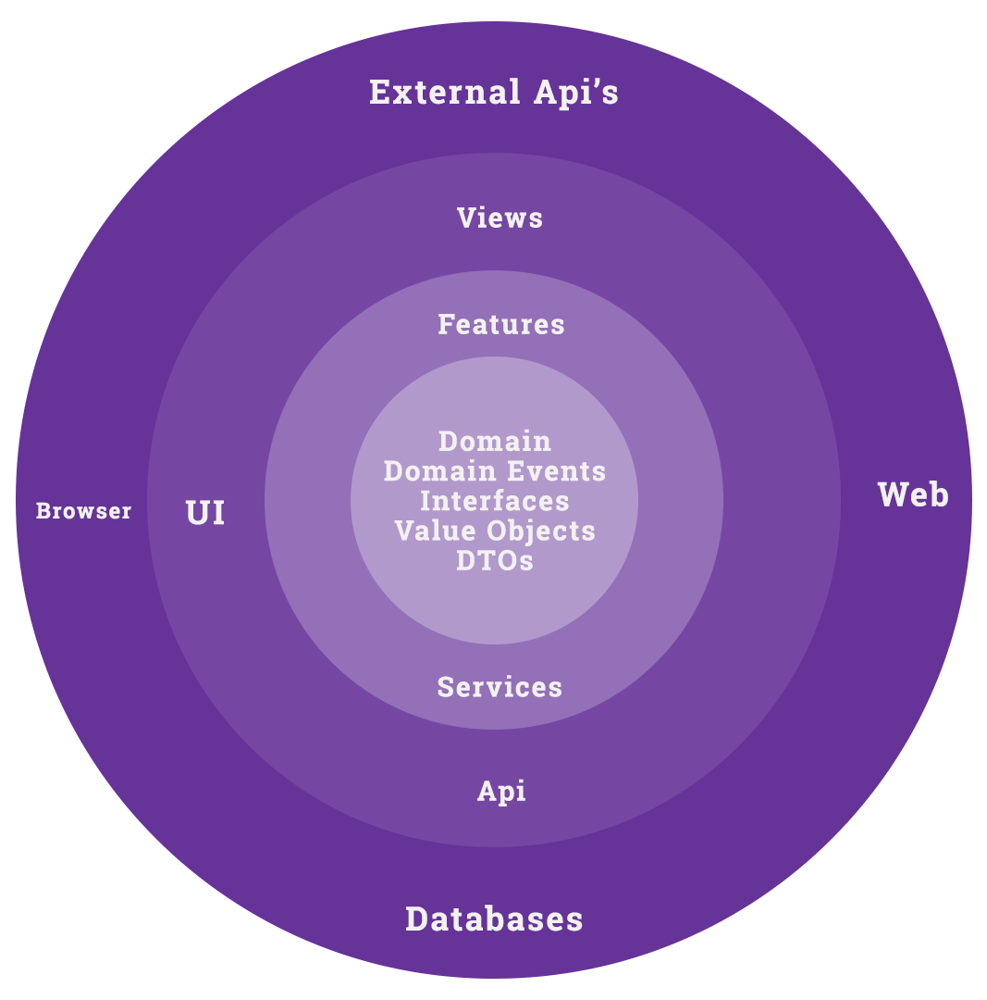

# .Net Core 3+ Web API,  Clean Architecture, DevOps and  Process

Clean Architecture at it's core is an architecture pattern where dependencies are taken on abstractions (such as interfaces). Core application/business concepts live in the middle and we conceptially move to the outside the implementations become more concrete. With this architecture we are able to test the application without needing the concrete implementations. We usually wire up concrete implementation at runtime through dependency injection.  At first, this can be confusing, but bear with me, I'll explain how it works in practice.


## Clean Architecture Conceptual Diagram





### The Flow of Dependencies

> The overriding rule that makes this architecture work is *The Dependency Rule*. This rule says that *source code dependencies* can only point *inwards*. Nothing in an inner circle can know anything at all about something in  an outer circle. In particular, the name of something declared in an  outer circle must not be mentioned by the code in the an inner circle.  That includes, functions, classes. variables, or any other named  software entity.
>
> By the same token, data formats used in an outer circle should not be used by an inner circle, especially if those formats are generate by a  framework in an outer circle. We don’t want anything in an outer circle  to impact the inner circles.  - [Uncle Bob Martin](https://blog.cleancoder.com/uncle-bob/2012/08/13/the-clean-architecture.html)


## Projects

### Clean.Core

Clean.Core holds the business domain, such as entities, value objects, interfaces, DTOs, etc, many of the system's nouns live in this project. For example, the user DTO might live in this project. 


There also can be Domain Services provide functionality and operate on other Core (Clean.Core) concerns. 


### Clean.FeatureSets

Clean.FeatureSets is where the vertical slices of the business functionality live. This project leverages Mediatr from Jimmy Bogard. I'll talk more to Mediatr later. In a nutshell Mediatr implements the [mediator pattern](https://en.wikipedia.org/wiki/Mediator_pattern), thus eliminating the coupling between the featureSets and the Clean.Api Project. If  we didn't use the mediator pattern, we'd likely need to share a common class hierachry between the Clean.Api and Clean.FeatureSets projects which would couple the two projects.


Vertical Slice architecture originally gained populatiryt on the client-side. Before vertical slices, functainlity was grouped by type, for example, all  controllers lived in a controller folder. This scattered related functinality from each other. Vertical Slices brings all the related functionality together, usually within the same folder. 


When a change is needed, an engineer doesn't need to hunt around the application looking for the code to change, all of it is in a single folder. In practice, it's not always possible to put all the related code together, however the code can be grouped together in various layers making discovery much easier.


For more on Vertical Slices see [Jimmy Bogard's article on the subject](https://jimmybogard.com/vertical-slice-architecture/).


#### Sample Endpoints 

- http://localhost:5000/api/users/status/active - requires a header of x-api-key with a value of 9876
- http://localhost:5000/api/users/status/suspended - no authentication require


#### Authentication and Authorization

Authentication can be done many ways. In this example an ActionFilter is implemented to demonstrate how ActionFilters work rather than how to implement authentication.  To add authentication, my recommendation is to use libraries, patterns and libraries built by Microsoft and other respected security experts in the industry.


 ## Patterns and Libraries Used

 - AutoMapper
 - Bogus
 - Clean Architecture
 - FluentAsserts
 - Mediatr
 - Repository Pattern
 - Specification Pattern
 - XUnit

 ### AutoMapper

 [AutoMapper](https://automapper.org/) is an injectable API for mapping one type to another. It centralizes and allows for mapping reuse that typically happens between types when crossing layer boundaries (UI/API, Domain, Data, External Services).


### Bogus

[Bogus](https://github.com/bchavez/Bogus) is an library for creating dummy realistic test data. This library is used to create data to API against.

 ### Clean Architecture

 Also called Onion Architecture or Ports and Adapters, it's an architecture pattern made popular by [Uncle Bob](http://cleancoder.com)'s [Clean Architecture book](https://www.amazon.com/dp/0134494164).

 Clean Architecture, in its simplest essence, is coupling to abstractions such as interfaces or abstract classes when taking a dependency on behavior. This allows for implementations of the behavior to be determined at a later time, which could include runtime decisions or changing the behavior during testing.

 ### Mediatr

 [MediatR](https://github.com/jbogard/MediatR) is used to isolate the responsibilities of each endpoint. This facilitates possibly moving to a microservices architecture, in the future, which is accomplished by grouping the Mediator implementations into Bounded Contexts and then wrapping the Bounded Contexts into an API.

 MediatR is an implementation of the mediator pattern, allowing two pieces of code to work independently but communicates via the mediator. The benefit of using the Jimmy Bogards implementation is it has a few extra bells and whistles built into it such as Notifications (think Domain Events), a Behavior Pipeline (Logging, Exception handling, etc.)


 ### Repository Pattern
 The [Repository Pattern](https://deviq.com/repository-pattern/) is a common pattern used to isolate data access logic, typically when retrieving or persisting data to a database. This allows data access logic reuse or swapping out (maybe to support a different flavor of databases) implementations during testing or at runtime.

 One of the downsides to the Repository Pattern is what I call Repository Pattern hell. This happens when one Repository depends on another, but the other depends on the one that depends on it. Confused? Yeah, me too, but basically it creates a cyclomatic relationship.

 ### Specification Pattern

 The [Specification Pattern](https://deviq.com/specification-pattern/) decouples and abstracts the conditions which are used to filter a collection of items. This allows for generic filter code, testing the conditions independently of the data sets and for condition reuse.

```c#
   public class AccountStatusSpecifications : DataSpecification<User>
   {
     public AccountStatusSpecifications(AccountStatus status)
     {
       Where(s => s.AccountStatus == status);
     }
   }
```

 

 ## Testing

 ### Fluent Assertions

 [Fluent Assertions](https://fluentassertions.com/) brings much-needed readability to the tests in the code and the failed tests. It also brings added tools to testing, such as comparing object hierarchies and collection, which otherwise would have to be tested individually or implemented for the testing effort.


```c#
[Fact]
public void filter_user_by_account_status()
{
    var specification = new AccountStatusSpecifications(AccountStatus.Active);
    var users = DataSpecificationProcessor<User>.BuildQuery(_users.AsQueryable(), specification);

    users.ToList().Should().HaveCount(1);
}
```


 ### XUnit

 [XUnit](https://xunit.net/) brings simplicity to testing in .Net. Its minimal testing approach gives you the tools to test your application without getting in your way.


### MOQ


//Write / Code

- [ ]  Instrumentation

- [ ]  Testing

  - [ ]  Unit
  - [ ]  Integration
  - [ ]  UI (https://medium.com/welldone-software/an-overview-of-javascript-testing-in-2019-264e19514d0a)

- [ ]  Process (build)

- [ ]  Memory Caching

- [ ] Memory Management in Blazor (Prism)

- [ ] Bring in Framework to send messages some the Business layer to the UI.

  